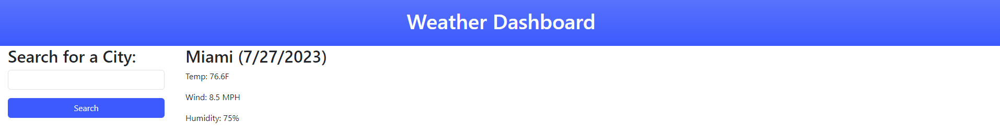

# <Weather Dashboard>

##  Weather Dashboard

Provide a short description explaining the what, why, and how of your project. Use the following questions as a guide:

- What was your motivation?

the motivation behind this project was to build out an interactive weather app using dayjs, bootstrap and also reenforcing fundamentals of js.

- What did you learn?

getting a grasp on the functions and using dayjs and bootstrap to help building out the page, and learning how to then expand on that for future projects.

## Table of Contents 

- [Installation](#installation)
- [Usage](#usage)
- [License](#license)

## Installation

What are the steps required to install your project? Provide a step-by-step description of how to get the development environment running.
Access the github link provided: https://github.com/Devinmarshill/Weather-Dashboard

Webpage URL: https://devinmarshill.github.io/Weather-Dashboard/

## Usage

Allows users to get weather for a specific city when searched

## Credits

AskBCS, Office Hours, TA, Instructor

## License

MIT license: [](https://opensource.org/licenses/MIT.

---
